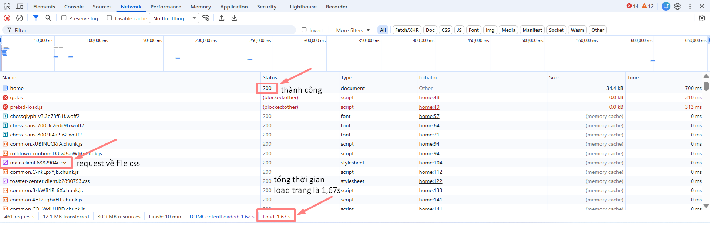
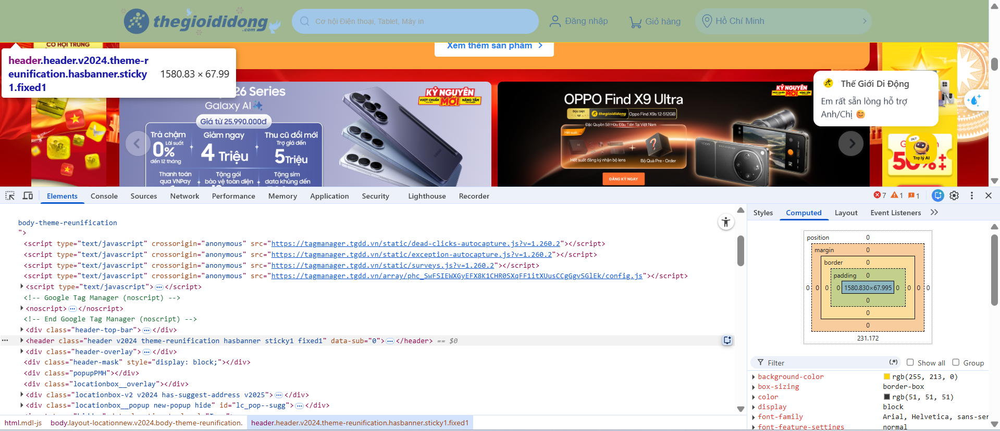
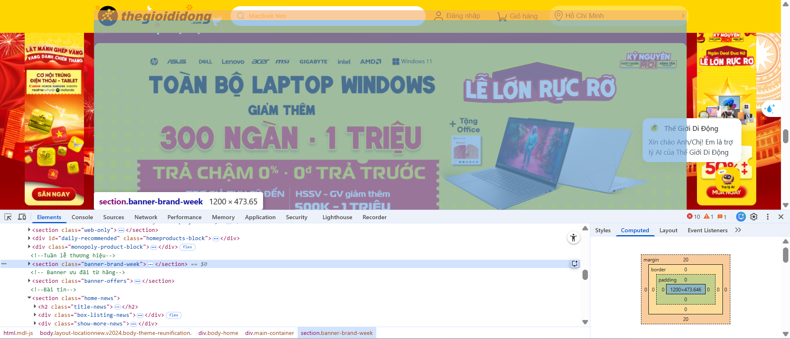
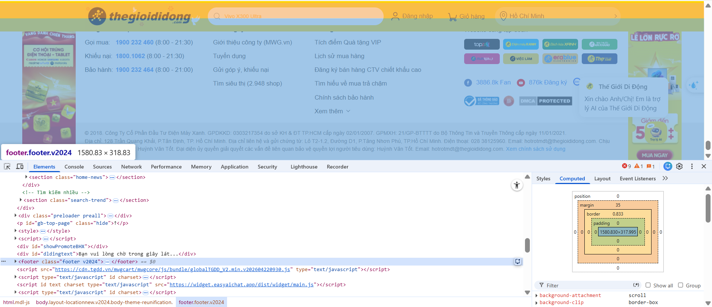
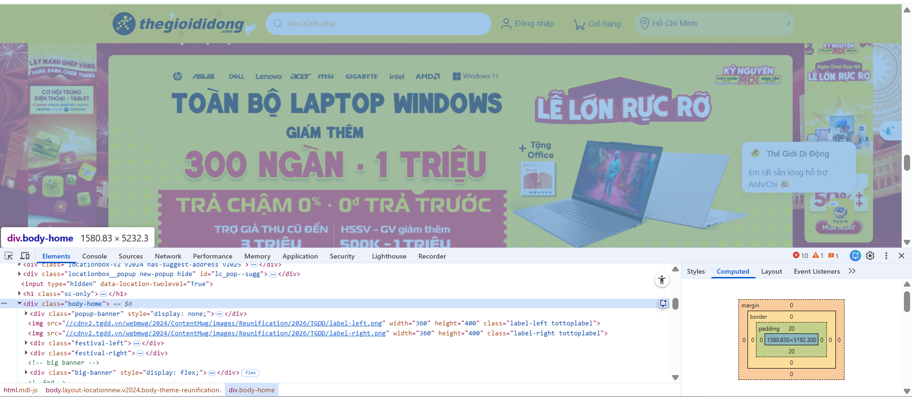
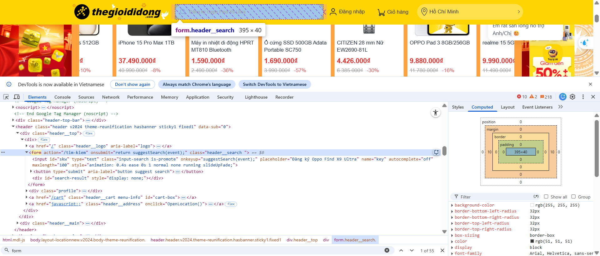

# Phần A: Đọc Hiểu

_Câu A1_

Khi gõ https://shopee.vn vào trình duyệt và nhấn Enter, thứ tự 5 bước xảy ra là:

1. Gửi Request: trình duyệt hỏi DNS Server "shopee.vn là IP nào?" và nhận về địa chỉ IP sau đó gửi yêu cầu đến Server thông qua mạng Internet
2. Server xử lý: "Trường muốn xem trang chủ shopee"
3. HTTP Response: Server sẽ gửi các file như html, css, js cho bên trình duyệt cũng thông qua mạng Internet
4. Parse html, css & execute js: Trình duyệt sẽ đọc các file html như bản kiến trúc, css như bản nội thất và xử lý js như lắp đặt hệ thống điện nước
5. Paint & render: Trình duyệt sẽ hoàn thiện và hiển thị giao diện lên trên màn hình cho Trường xem

Tab Network cho thấy toàn bộ các request mà trình duyệt gửi đi khi tải trang



_Câu A2_

Lỗi 1 — Dùng `<div>` thay vì thẻ semantic
Google không hiểu đâu là header, nav, main, footer. Với `<div class="header">` thì class "header" chỉ là tên cho con người đọc, máy không hiểu.

Lỗi 2 — Không có thẻ `<h1>` hay heading nào
Google dùng heading để hiểu nội dung chính của trang. Tên sản phẩm "iPhone 16 Pro" đang nằm trong `<div class="title">` — Google không biết đây là tiêu đề quan trọng.

Lỗi 3 — Thẻ `` thiếu thuộc tính alt
Google đọc alt để hiểu ảnh nói về cái gì. Thiếu alt thì ảnh vô nghĩa với cả Google lẫn người dùng dùng screen reader.

Lỗi 4 — Menu điều hướng không dùng `<nav>`
Google ưu tiên `<nav>` để xác định cấu trúc điều hướng của trang. Dùng `<div class="menu">` thì Google không nhận ra đây là menu.

## Sửa lại lỗi

```html
<header>
  <div class="logo">ShopTLU</div>
  <nav>
    <ul>
      <li><a href="/">Trang chủ</a></li>
      <li><a href="/products">Sản phẩm</a></li>
    </ul>
  </nav>
</header>

<main>
  <article class="product">
    <h1>iPhone 16 Pro</h1>
    <p class="price">25.990.000đ</p>
    
  </article>
</main>

<footer>© 2026 ShopTLU</footer>
```

_Câu A3_

```
┌─────────────┐
│   Hộp 1     │  ← div: chiếm cả hàng
└─────────────┘
Text A Text B     ← span: nằm cùng hàng nhau
┌─────────────┐
│   Hộp 2     │  ← div: xuống hàng mới
└─────────────┘
Text C **Text D**  ← span + strong: cùng hàng, Text D in đậm
┌─────────────┐
│   Hộp 3     │  ← div: xuống hàng mới
└─────────────┘
```

_Câu A4_
`<thead>` là phần đầu bảng (tiêu đề cột)
`<tbody>` là phần thân bảng (dữ liệu chính)
`<tfoot>` là phần chân bảng (tổng kết)

Lý do không nên dùng table để tạo layout trang web

1. Lý do 1 — Sai ngữ nghĩa (semantic)
   `<table>` sinh ra để hiển thị dữ liệu dạng bảng, không phải để chia cột layout. Google và screen reader hiểu `<table>` là "đây là bảng dữ liệu" — dùng sai mục đích làm SEO và accessibility kém đi.

2. Lý do 2 — Code phức tạp, khó bảo trì
   Layout bằng table phải lồng `<tr>`, `<td>` chằng chịt, rất khó đọc và sửa. Thêm một cột hay thay đổi bố cục là phải sửa rất nhiều chỗ.

3. Lý do 3 — Tải chậm hơn
   Trình duyệt phải đọc toàn bộ table trước khi render, vì cần biết kích thước tất cả các ô.

# Phần B: Thực hành code

_Câu B3_
Lỗi 1: Dòng 1 — `<!DOCTYPE>` thiếu khai báo html — Sửa thành `<!DOCTYPE html>`

Lỗi 2: Dòng 2 — `<html>` thiếu thuộc tính `lang` — Sửa thành `<html lang="vi">`

Lỗi 3: Dòng 4 — `<title>Trang web` không có thẻ đóng — Sửa thành `<title>Trang web</title>`

Lỗi 4: Dòng 5 — `<meta charset="utf8">` sai giá trị charset — Sửa thành `<meta charset="UTF-8">`

Lỗi 5: Dòng 8 — `<h1>Welcome to ShopTLU<h1>` thẻ đóng thiếu dấu `/` — Sửa thành `<h1>Welcome to ShopTLU</h1>`

Lỗi 6: Dòng 11 — `<a href="home">Trang chủ<a>` thẻ đóng thiếu dấu `/` và href không dùng `#` — Sửa thành `<a href="#home">Trang chủ</a>`

Lỗi 7: Dòng 19 — `` src không có dấu nháy và thiếu thuộc tính `alt` — Sửa thành ``

Lỗi 8: Dòng 21 — `<p>Giá: <b>25.990.000đ</p></b>` thẻ đóng bị lồng sai thứ tự — Sửa thành `<p>Giá: <b>25.990.000đ</b></p>`

Lỗi 9: Dòng 26 — Hàng đầu tiên của bảng dùng `<td>` thay vì `<th>`, và bảng thiếu `<thead>`/`<tbody>` — Sửa bằng cách thêm `<thead><tbody>` và đổi `<td>` thành `<th>` cho hàng tiêu đề

Lỗi 10: Dòng 40 — Dùng `<main>` lần 2 cho sidebar — Một trang chỉ được có 1 thẻ `<main>`, sidebar phải dùng `<aside>` — Sửa thành `<aside>` nằm trong `<main>`

Lỗi 11: Dòng 17 — `<h1>` nằm ngoài `<header>` và đứng trước `<header>` — Semantic sai, `<h1>` nên nằm trong `<header>`

Lỗi 12: Dòng 45 — `<p>Copyright 2026` không có thẻ đóng `</p>` — Sửa thành `<p>Copyright 2026</p>`

Lỗi 13: Dòng 20 — `<h3>Sản phẩm hot</h3>` nhảy từ `<h1>` xuống thẳng `<h3>`, bỏ qua `<h2>` — Sai cấu trúc heading, sửa thành `<h2>`

_Câu B4_

Trong trang web thegioididong.com:

1. 3 thẻ semantic HTML5 mà trang đó sử dụng

- Thẻ `<header>`:
  

- Thẻ `<section>`
  

- Thẻ `<footer>`
  

- Thẻ `<body>`mà trang đó KHÔNG dùng đúng semantic
  

2. Trang thegioididong không dùng thẻ `<table>`

3. Thẻ `<form>`
   
   Form có action là <`action="/tim-kiem"`>. Khi submit, dữ liệu sẽ được gửi đến đường dẫn `/tim-kiem`
   Không có method nên sẽ mặc định là GET
   Input có 2 loại là text để nhập và button để click
